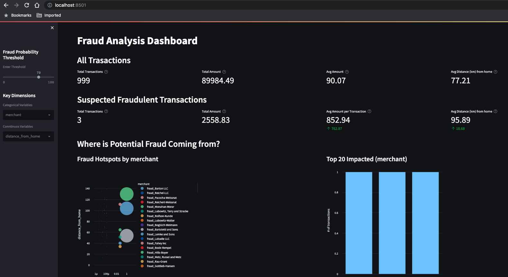

# Before you start
Make sure your system has the following components:
* Docker Compose - Included in [Docker Desktop](https://docs.docker.com/desktop/)
    * [Docker Desktop for Mac](https://docs.docker.com/desktop/install/mac-install/)
    * [Docker Desktop for Linux](https://docs.docker.com/desktop/install/linux-install/)
    * [Docker Desktop for Windows](https://docs.docker.com/desktop/install/windows-install/)
* [Hazelcast 5.2.1](https://docs.hazelcast.com/hazelcast/5.2/getting-started/get-started-cli) installed on your system
* [Git LFS](https://git-lfs.com/)
* [Conda](https://docs.conda.io/projects/conda/en/latest/user-guide/install/index.html)
* AWS User and CLI
    * [Aws CLI](https://aws.amazon.com/cli/) installed and configured to work with your AWS user
    * Your AWS user has the [IAM permissions listed here](https://docs.docker.com/cloud/ecs-integration/#run-an-application-on-ecs)
    * Run `aws configure` with your AWS user to set up preferred AWS region (e.g. us-east-2), AWS Key & Secret

# Fraud Detection With Hazelcast and ONNX

In this demo, you will deploy a complete Fraud Detection Inference pipeline to Hazelcast. 
The pipeline highlights two key capabilities in Hazelcast:
* Fast (in-memory) data store to hold
    * Customer and Merchant feature data (e.g customer socio-economic attributes, merchant category etc)
    * Feature engineering data dictionaries used to tranform categorical features into numerical inputs for a Fraud Detection model

* Efficient data stream processing and compute capability required to
    * Process a stream of incoming credit card transactions
    * Calculate real-time features (e.g. distance from home, time of day, day of week)
    * Perform low-latency customer and merchant feature data retrieval
    * Perform feature engineering to turn features into model inputs
    * Run a LightGBM fraud detection model inside Hazelcast using ONNX runtime.
        * Individual inference times under 0.1ms 
        * Note: The was trained with LightGBM framework and exported to ONNX format. 

# Create a Kafka Cluster & Topic with Confluent Cloud
You will use Kafka as source of credit card transactions coming into your fraud detection inference pipeline.

* A simple way to get Kafka running is to [Create a Kafka Cluster in Confluent Cloud](https://www.confluent.io/get-started/?product=cloud)

    * Make sure you deploy your Kafka Cluster to AWS and use the same region used previously set in `aws configure` 

    * Once your cluster is created, go to `Cluster Settings-> Endpoints` and capture your Kafka Cluster `bootstrap server` URL

    

Store it as an environment variable
```
export KAFKA_ENDPOINT=pkc-ymrq7.us-east-2.aws.confluent.cloud:9092
```

* From `API Keys`-> click `Add Key` and make sure you capture your new Key and Secret

    

Store the Key and Secret as environment variables
```
export KAFKA_CLUSTER_KEY=5BCBBMROQCA4L4SK
export KAFKA_CLUSTER_SECRET=<YOUR_SECRET>
```

* Now, you need to [create a 'Transactions' topic](https://docs.confluent.io/cloud/current/get-started/index.html#step-2-create-a-ak-topic) in your cluster

Make sure you name your Topic "Transactions". It is important!


# Deploy Hazelcast-Onnx, Management Center and Fraud Analytics Dashboard to AWS ECS

In this demo, you will spin up 3 containers in AWS ECS:
* A single-node Hazelcast cluster
* A Hazelcast Management Center instance
* A custom Fraud Analytics dashboard 

These container images can be deployed to the cloud provider of your choice or run locally (preferably on an AMD64 machine).
For simplicity, we'll use AWS ECS to deploy via the familiar  `docker compose` commmand.


## The Hazelcast + Onnx container
We've built a docker image preloaded with:
* Hazelcast 5.2.1 running on Ubuntu 22.04
* ONNX runtime libraries in a supported platform/OS/Programming language combination (e.g AMD64/Linux/Java)
* Some sample Transaction data (in csv files) for testing purposes

Note that this image will run on ARM devices, like an Apple M1-powered device, via emulation. 
However, the performance and stability is negatively impacted when running in emulation mode on Apple M1 devices.

## The  Fraud Analytics Dashboard
This docker image bundles a custom Streamlit app that connects automatically to the `hazelcast-onnx` container. 
The app:
* is Written entirely in Python,
* Uses Hazelcast Python client and SQL to query JSON data stored in Hazelcast


## Deploy containers to AWS ECS with Docker Compose

Create a docker "Context" to deploy a `docker compose` file to AWS ECS
```
docker context create myecscontext
docker context use myecscontext
```

Now that you've switch to your `myecscontext`, docker compose will use AWS ECS as deployment target.

```
docker compose up
```
This will take 5-10 minutes to complete

Once the process completes, you can check the 3 containers are up and running
* `hazelcast-onnx` 
* `fraud-dashboard`
* `management-center`

```
docker compose ps
```


For convenience, store `hazelcast-onnx` server and port in an environment variable (HZ_ONNX).
For example:
```
export HZ_ONNX=ecsde-LoadB-1NHRSHPTW92BJ-7b72b00b647ecd29.elb.us-east-2.amazonaws.com:5701
```

Make a note of the IP:port of the management center and fraud detection containers. The only difference with your `HZ_ONNX` container is the port number! AWS created a Load Balancer in front of the 3 containers.
If your `HZ_ONNX` is `ecsde-LoadB-1NHRSHPTW92BJ-7b72b00b647ecd29.elb.us-east-2.amazonaws.com:5701`, then
* Your Management Center will be accessible on `ecsde-LoadB-1NHRSHPTW92BJ-7b72b00b647ecd29.elb.us-east-2.amazonaws.com:8080`
* Your Fraud Analytics Dashboard will be on  `ecsde-LoadB-1NHRSHPTW92BJ-7b72b00b647ecd29.elb.us-east-2.amazonaws.com:8501`

# Load Feature data and Fraud Detection Inference Jobs into Hazelcast

These Feature data jobs will simply load the Customer & Features from JSON and CSV files into [Hazelcast Maps](https://docs.hazelcast.com/hazelcast/5.2/data-structures/map) 

Once these jobs are executed, the fraud inference pipeline will also be deployed. 

First, go into the feature-data-loader folder
```
cd ../feature-data-loader
```

and run
```
hz-cli submit -v -t $HZ_ONNX \
     -c org.example.client.DeployFraudDetectionInference \
    target/feature-data-loader-1.0-SNAPSHOT.jar lightgbm_fraud_detection_onnx
```

After a few seconds, you should see an output similar to


# About The Fraud Detection Inference Pipeline ...

At a high-level, the Fraud Detection inference pipeline executes the following steps:
* Start pulling transactions from Kafka (with minimal information such as Credit Card Number, Merchant, Amount, Transaction date and Geolocation )
* Enrich these transactions with with Customer and Merchant Features (e.g. customer's socio-demographic data, historical purchases etc, average spent, spent in last month, etc)
* Calculate real-time features such as "distance from home" (distance from transaction Geolocation and the Customer's billing address).
* Perform Feature engineering required to convert Customer and Merchant features into numeric values required by the Fraud Detection model
* Run the Fraud Detection model to obtain a fraud probability for each transaction
* Store prediction results (in JSON format) as Hazelcast maps for further analysis


## Production Ideas
In a real-world scenario, the end of the inference pipeline is typically the start of other pipelines. For example, you could create pipelines to:

* Trigger automatic customer validation request for potentially fraudulent transactions
* Trigger automatic alerts to ML-Ops team warning about model/data drift.
* Update Customer "online features" such as `"last known coordinates"`, `"last transaction amount"`. `"amount spent in the last 24 hours"`, `"number/value of transactions attempted in the last X minutes/days"`


# Load some transactions into Kafka

Next, You will load 100k transactions into Kafka. This will trigger the Fraud Detection Pipeline submitted in the previous section. 

Note that the transactions are preloaded as CSV files in your `hazelcast-onnx` container.

```
cd transaction-loader 
```

Followed by 
```
hz-cli submit -v -t $HZ_ONNX -c org.example.Main target/transaction-loader-1.0-SNAPSHOT.jar 100k-transactions.csv
```

You should see a "Transaction Loader Job" success message in the output


As the transactions load into Kafka, they will trigger the Fraud Detection Inference Pipeline

# Monitoring in Hazelcast

Use your browser to navigate to Management center  (e.g `ecsde-LoadB-1NHRSHPTW92BJ-7b72b00b647ecd29.elb.us-east-2.amazonaws.com:8080`)


Explore your Fraud Detection Inference Pipeline


# Fraud Analytics Dashboard (Python, SQL and Hazelcast)
Use your browser to navigate to Fraud Analytics dashboard  (e.g `ecsde-LoadB-1NHRSHPTW92BJ-7b72b00b647ecd29.elb.us-east-2.amazonaws.com:8501`)

The Fraud Analytics Dashboard should look like this


Don't forget to check the code in `python-sql\app.py` to see examples of how you can query JSON data stored in Hazelcast with SQL!

# Teardown - Stop all Containers

```
cd ..
docker compose down
```

This will take another 5-10 minutes

You may also want to return Docker to your "default" context. 

This will prevent future `docker compose` inadvertedly deploying to AWS ECS!

```
docker context use default
```


## (Optional) Building Your own hazelcast-onnx image
If you want to create your own hazelcast-onnx image and preload it with your data and model, you can check the [`Dockerfile`](./hz-onnx-debian/Dockerfile) under the  `hz-onnx-debian` folder.

Once you are happy with your updates to `Dockerfile`, you can create and publish your image by running 

```
cd ..
docker-compose -f build-hz-onnx-image.yml build
docker tag fraud-detection-onnx-hazelcast-onnx-debian <your-github-username>/<image-name>
docker push <your-github-username>/<image-name> 
```

## (Optional) Train the model and convert it to ONNX

To-Do
