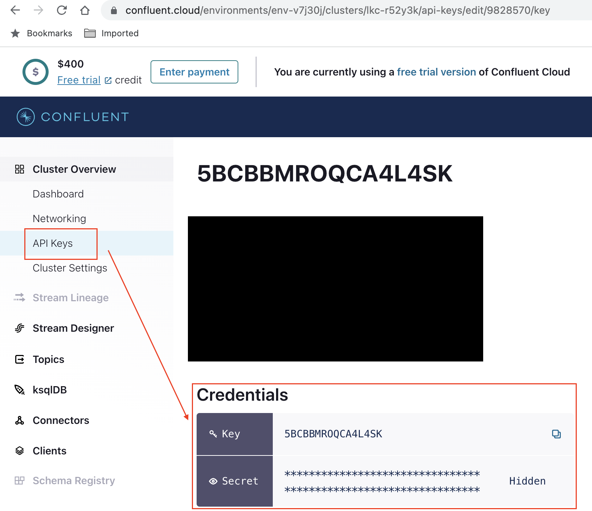

# Before you start
Make sure you have:
*  [`aws cli`](https://aws.amazon.com/cli/) configured to work with your AWS account.
* An AWS Cloud user with [IAM permissions listed here](https://docs.docker.com/cloud/ecs-integration/#run-an-application-on-ecs)
* Docker Compose 
* Hazelcast 5.2.1 installed on your system
* Install [Git LFS](https://git-lfs.com/)


# Fraud Detection With Hazelcast and ONNX

In this demo, you will deploy a complete Fraud Detection Inference pipeline to Hazelcast. 
The pipeline highlights two key capabilities in Hazelcast:
* Fast (in-memory) data store to hold
    * Customer and Merchant feature data (e.g customer socio-economic attributes)
    * Feature engineering data dictionaries to tranform categorical features into numerical inputs for a Fraud Detection model
        * The fraud detection model was trained using the LightGBM framework and then exported to ONNX format. 
* Efficient data stream processing and compute capability required to
    * Process a stream of incoming credit card transactions
    * Calculate real-time features (e.g. distance from home, time of day, day of week)
    * Perform low-latency customer and merchant feature data retrieval
    * Perform feature engineering to turn features into model inputs
    * Run fraud detection model inside Hazelcast using ONNX runtime.
        * Individual inference times under 0.1ms 

# Create a Kafka Cluster & Topic with Confluent Cloud
You will use Kafka as source of credit card transactions coming into your fraud detection inference pipeline.

* A simple way to get Kafka running is to [Create a Kafka Cluster in Confluent Cloud](
https://docs.confluent.io/cloud/current/get-started/index.html#quick-start-for-ccloud)

    * Once your cluster is created, go to `Cluster Settings-> Endpoints` and capture your Kafka Cluster `bootstrap server` URL

    

Store it as an environment variable
```
export KAFKA_ENDPOINT=pkc-ymrq7.us-east-2.aws.confluent.cloud:9092
```

* From `API Keys`-> click `Add Key` and make sure you capture your new Key and Secret

    

Store the Key and Secret as environment variables
```
export KAFKA_CLUSTER_KEY=5BCBBMROQCA4L4SK
export KAFKA_CLUSTER_SECRET=<YOUR_SECRET>
```

* Now, you need to [create a 'Transactions' topic](https://docs.confluent.io/cloud/current/get-started/index.html#step-2-create-a-ak-topic) in your cluster

Make sure you name your Topic "Transactions". It is important!


# Deploy a Hazelcast-Onnx Container to AWS ECS

We've created a docker image preloaded with:
* Hazelcast 5.2.1 running on Ubuntu 22.04
* ONNX runtime libraries in a supported platform/OS/Programming language combination (e.g AMD64/Linux/Java)
* Some sample Transaction data (in csv files) for testing purposes

This image can be deployed to your cloud provider of choice or run locally (preferably on an AMD64 machine). \

Note that the image will run on ARM devices, like an Apple M1-powered device, via emulation. However, the performance and stability is noticeably impacted when running in emulation mode

## Deploy Hazelcast-Onnx image to AWS ECS with Docker Compose

Create a docker "Context" to deploy a `docker compose` file to AWS ECS
```
docker context create myecscontext
docker context use myecscontext
```
Check the docker-compose.yml file.\ 

You can now deploy the hazelcast-onnx container with
```
docker compose up
```
This will take 5-10 minutes to complete

Once the process completes, you can check the hazelcast-onnx server name & port by running

```
docker compose ps
```


For convenience, store the `hazelcast-onnx` address:port as an environment var
```
export HZ_ONNX=ecsde-LoadB-1NHRSHPTW92BJ-7b72b00b647ecd29.elb.us-east-2.amazonaws.com:5701
```

# Load some transactions into your Kafka

Next, You will Hazelcast's CLI, `hz-cli`, to submit a data loading job that will upload 100k "Transactions" into Kafka. The transactions are preloaded as CSV files in your `hazelcast-onnx` container.

```
cd transaction-loader 
```

Followed by 
```
hz-cli submit -v -t $HZ_ONNX -c org.example.Main target/transaction-loader-1.0-SNAPSHOT.jar 100k-transactions.csv
```

After a few seconds, you should see a "Transaction Loader Job" success message in the output


# Load Feature data and Transaction Inference Jobs into Hazelcast


These Feature data jobs will simply load the Customer & Feature data from JSON and CSV files into [Hazelcast Maps](https://docs.hazelcast.com/hazelcast/5.2/data-structures/map) 

Once these jobs are executed, the fraud inference pipeline will also be deployed. This will start processing incoming transactions from Kafka

First, go into the feature-data-loader folder
```
cd ../feature-data-loader
```

and Run
```
hz-cli submit -v -t $HZ_ONNX \
     -c org.example.client.DeployFraudDetectionInference \
    target/feature-data-loader-1.0-SNAPSHOT.jar lightgbm_fraud_detection_onnx
```

After a few seconds, you should see an output similar to


# About The Fraud Detection Inference Pipeline ...

At a high-level, the Fraud Detection inference pipeline executes the following steps:
* Take a transaction from Kafka (with minimal information such as Credit Card Number, Merchant, Amount, Transaction date and Geolocation )
* Enrich this transaction with with Customer and Merchant Features (e.g. customer's socio-demographic data, historical purchases etc, average spent, spent in last month, etc)
* Calculate real-time features such as "distance from home" (distance from transaction Geolocation and the Customer's billing address).
* Perform Feature engineering required to convert Customer and Merchant features into numeric values required by the Fraud Detection model
* Run the Fraud Detection model to obtain a fraud probability

Finally, and for the purposes of this demo, the pipeline perform two actions:

* All potentially fraudulent transactions, (e.g. filter those with fraud probability higher than 0.5), are logged to the console
* <TO-DO> All predictions and incoming transactions are saved in memory (as IMaps) 24 hours for further analysis

## Production Ideas
In a real-world scenario, the end of the inference pipeline is typically the start of other pipelines. For example, you could create pipelines to:

* Trigger automatic customer validation request for potentially fraudulent transactions
* Trigger automatic alerts to MLOPs team warning about model/data drift.
* Update Customer "online features" such as `"last known coordinates"`, `"last transaction amount"`. `"amount spent in the last 24 hours"`, `"number/value of transactions attempted in the last X minutes/days"`

# Check Logs for potential Fraudulent transactions
You should see some of these potential fraud cases identified by the model by inspecting the logs.

```
docker compose logs hazelcast-onnx
```

You should see "potential fraud cases" as shown in the image below\

You can see how the original transaction has been processed by the Fraud Detection pipeline


# Monitoring in Hazelcast
You can start Hazelcast Management Center and check status of the multiple jobs

Create a connection to `Your hazelcast-onnx address`:5701

Find details of the Fraud Detection Inference Pipeline\


In this case, please note that Total Out / Last Minute Out refer to potential fraud cases only!


# Stop all Containers

```
docker compose down
```

You may also want to return Docker to your "default" context. This will prevent `docker compose` to deploy to AWS ECS

```
docker context use default
```

## (Optional) Train the model and convert it to ONNX

To-Do


## (Optional) Building Your own hazelcast-onnx image
If you wanted to create your own hazelcast-onnx image and preload it with your data and model, you can check the `Dockerfile` in the `hz-onnx-debian` folder for inspiration.

```
docker-compose -f build-hz-onnx-image.yml build
docker tag fraud-detection-onnx-hazelcast-onnx-debian <github-username>/<image-name>
docker push <github-username>/<image-name> 
```

# Monitoring in Grafana

To-Do
