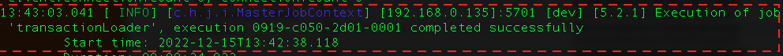

# Fraud Detection With Hazelcast and ONNX

In this demo, you will:
* Train a Fraud Detection model using LightGBM and Python 3.8  
    * Convert this model to ONNX
* Deploy a complete Fraud Detection Inference pipeline to Hazelcast featuring:
    * Use of Hazelcast's low-latency data store to hold:
        * Customer and Merchant feature data
        * Feature engineering data needed to produce inputs for the Fraud Detection model
    * Use of Hazelcast's stream processing capability to:
        * process an incoming stream of transactions
        * calculate real-time features (e.g. distance from home)
        * run the Fraud Detection Onnx Model inside the Hazelcast Cluster
    

# Start Kakfa and Hazelcast containers
```
docker-compose up -d
```

# Load 2.8M Transactions into a Kafka Topic (Transactions)
```
cd transaction-loader 
hz-cli submit -v -t localhost:5701 -c org.example.Main target/transaction-loader-1.0-SNAPSHOT.jar \
    $(pwd) transaction_data_stream.csv localhost:9092
```

After a few seconds, you should see a "Transaction Loading Job" message in the output




# (Optional) Building Your own Hazelcast-Onnx image
```
docker-compose -f build-hz-onnx-image.yml build
docker tag fraud-detection-onnx-hazelcast-onnx-debian <github-username>/<image-name>
docker push <github-username>/<image-name> 
```
